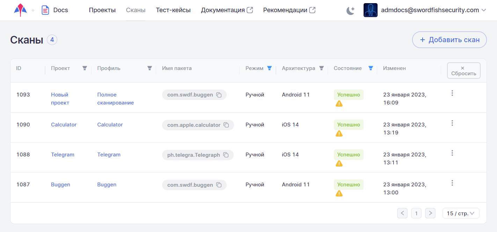
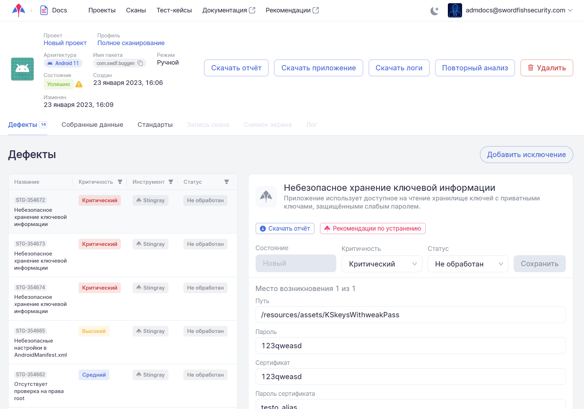
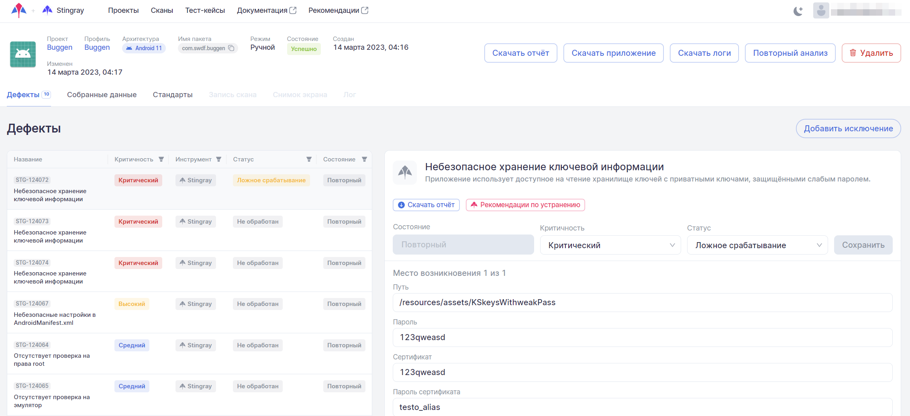
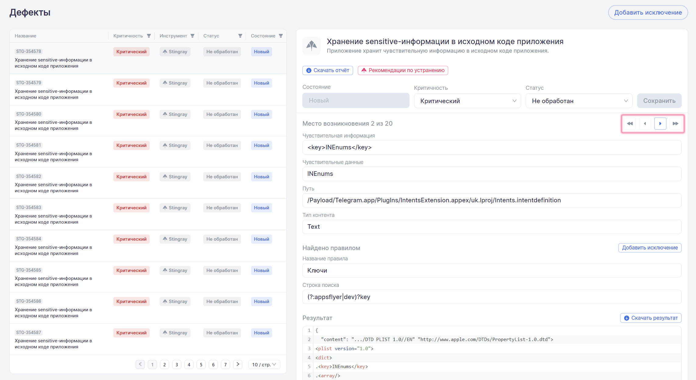
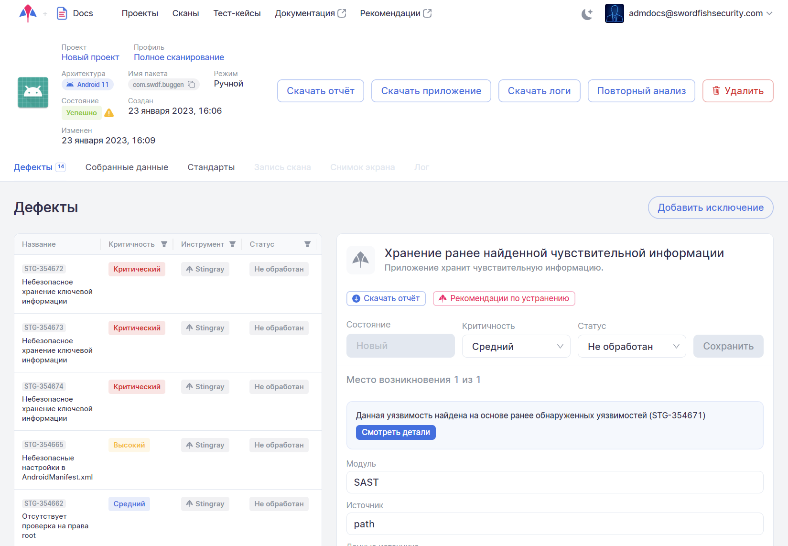
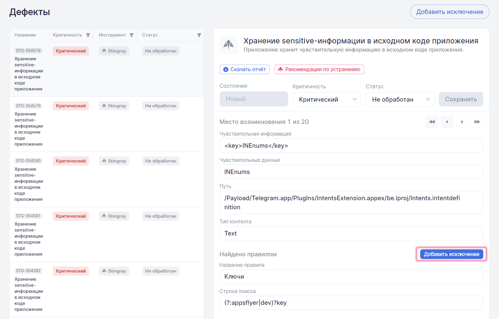
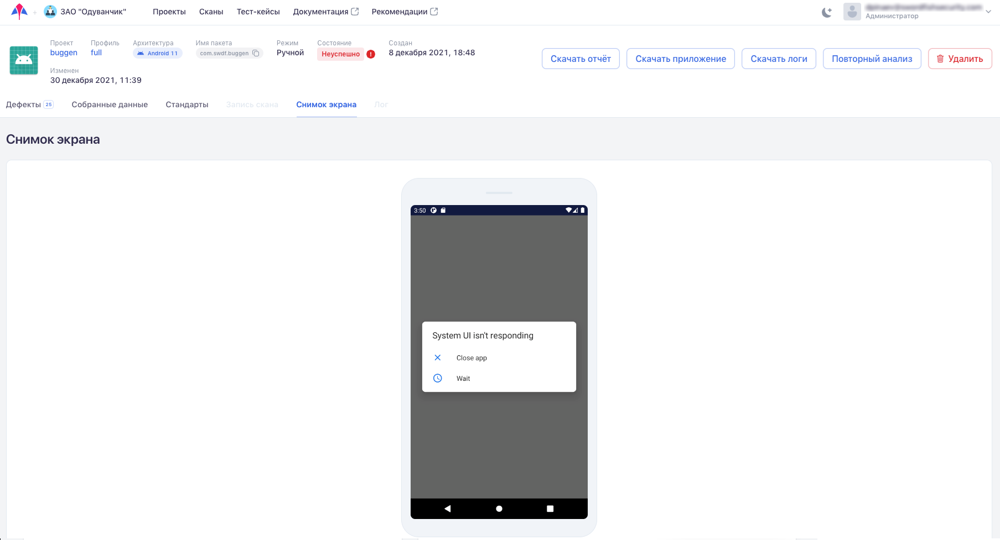
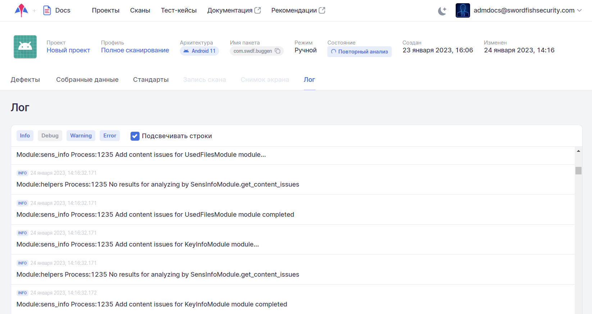
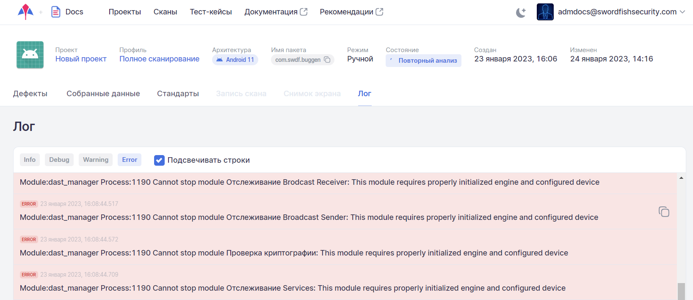

# Результаты сканирований

> О работе с результатами сканирования в «Стингрей» рассказывает эксперт команды разработки Никита Пинаев

> 

## Список результатов

При выборе пункта меню **Сканы** отображается список всех проведенных сканирований. Каждое сканирование представлено одной строкой. Данные о результатах сканирований автоматически обновляются каждые 10 секунд, что освобождает пользователя от необходимости обновлять страницу вручную.

<figure markdown></figure>

В списке отображаются сканирования, отсортированные по **ID**. В таблице присутствует следующая информация:

* **ID** — внутренний идентификатор сканирования. При нажатии на **ID** сканирования происходит переход к детальным результатам выбранного сканирования.
* **Проект** — имя проекта, в рамках которого проводилось сканирование. Данное значение представлено в виде ссылки, нажав которую можно перейти в соответствующий проект.
* **Профиль** — профиль сканирования, с которым было проанализировано приложение. Данное значение представлено в виде ссылки, нажав которую можно перейти в соответствующий профиль сканирования.
* **Имя пакета** анализируемого приложения.
* **Режим** — режим сканирования: ручной, автоматический режим **Стингрей** или автоматический режим с использованием скриптов Appium.
* **Архитектура** — тип архитектуры, включая версию операционной системы (например, Android 11 или iOS 14).
* **Состояние** — статус сканирования, может принимать несколько значений:
    * **Создан** — сканирование создано и помещено в очередь сканирования.
    * **Запускается** — сканирование запущено, идет процесс установки и запуска целевого приложения.
    * **Запущен** — происходит процесс сканирования.
    * **Анализ** — сканирование остановлено, осуществляется процесс анализа собранной информации.
    * **Успешно** — сканирование завершилось без ошибок. Если сканирование в целом прошло успешно, но наблюдались сбои в работе отдельных модулей, рядом со статусом отображается значок . При наведении на него курсора появляется более подробная информация о сбоях.
    * **Неуспешно** — сканирование завершено с ошибкой. Рядом со статусом отображается значок . При наведении на него курсора появляется более подробная информация об ошибке.
    * **Повторный анализ** — был запущен и еще не завершился повторный анализ результатов сканирования.
    * **Ожидание повторного анализа** — система получила запрос на повторный анализ результатов сканирования, но сам анализ еще не был запущен.
    * **Отменен** — сканирование отменено с использованием расположенного справа раскрывающегося меню.

* **Изменен** — время последнего изменения статуса сканирования.

Для отображения только необходимых результатов в колонках, отмеченных значком фильтра , предусмотрена установка фильтра. После установки фильтра в колонке цвет значка меняется на синий . При выборе нескольких фильтров они работают вместе, то есть при выборе режима **Ручной** и состояния **Успешно** будут найдены и отображены все успешно завершившиеся сканирования с ручным режимом запуска.

<figure markdown></figure>

При выборе проекта путем установки фильтра в колонке **Проект** в колонке **Профиль** будут доступны для выбора только профили этого проекта, с которыми ранее уже проводилось сканирование.

<figure markdown></figure>
  
Чтобы убрать установленный в одной колонке фильтр, нажмите на значок фильтра  и выберите пункт **Сбросить** в выпадающем меню.

<figure markdown></figure>

Чтобы убрать все установленные фильтры, нажмите на кнопку **Сбросить**, расположенную справа.

<figure markdown></figure>
 
!!! note "Примечание"
    Настройки фильтрации сохраняются при переходе на другие страницы системы и возвращении обратно на страницу **Сканы**.

Кроме этого, находясь на данной странице, можно:

* Открыть страницу с детальными результатами сканирования.
* Скачать PDF-отчет о сканировании.
* Скачать сканируемое приложение.
* Скачать логи сканирования.
* Инициировать повторный анализ.
* Удалить результаты сканирования. 

Для выполнения перечисленных действий используйте соответствующие пункты расположенного справа раскрывающегося меню «».

<figure markdown></figure>
 
## Результаты сканирования

Чтобы перейти на страницу с детальными результатами сканирования, нажмите либо на строку нужного сканирования в таблице **Сканы**, либо на расположенное справа в строке сканирования раскрывающееся меню «» и выберите пункт **Открыть**. На открывшейся странице содержится вся информация по анализу приложения: общая информация, выявленные уязвимости, собранные за время работы приложения данные, соответствие стандартам и требованиям. Для выбора доступно несколько вкладок в зависимости от режима и результата сканирования: **Дефекты**, **Собранные данные**, **Стандарты**, **Запись скана**, **Снимок экрана** и **Лог**. Вкладка **Запись скана** доступна только у сканирований, проведенных системой в автоматическом режиме. Вкладка **Снимок экрана** доступна только у сканирований, закончившихся со статусом **Неуспешно**, причиной завершения которых стала невозможность запуска приложения на агенте. Вкладка **Лог** доступна только во время анализа результатов сканирования.

### Общая информация

Общая информация приведена в верхней части страницы с детальными результатами сканирования. Она содержит сведения о проведенном сканировании и краткую информацию о проверенном приложении.

<figure markdown></figure>
  
Здесь представлена следующая общая информация по сканированию:

* **Проект**, в рамках которого проводилось сканирование. Данное значение представлено в виде ссылки, нажав которую можно перейти в соответствующий проект.
* **Профиль**, в рамках которого проводилось сканирование. Данное значение представлено в виде ссылки, нажав которую можно перейти в соответствующий профиль сканирования.
* **Тест-кейс** — название используемого тест-кейса. Данное значение представлено в виде ссылки, нажав которую можно перейти на страницу соответствующего тест-кейса. Это поле присутствует только у сканирований, проведенных в автоматическом режиме.
* **Архитектура** — архитектура сканируемого приложения (Android или iOS) и версия операционной системы, на которой проводилось сканирование. 
* **Имя пакета** — название пакета приложения в системе.
* **Режим** — режим сканирования: ручной, автоматический режим **Стингрей** или автоматический режим с использованием скриптов Appium.
* **Состояние** — статус проведенного сканирования. 
* **Создан** — дата проведения ручного тест-кейса или создания автоматического тест-кейса.
* **Изменен** — дата сканирования последнего изменения тест-кейса (например, дата проведения повторного анализа).

Кнопки, расположенные справа от общей информации, позволяют выполнить следующие действия:

* **Скачать отчет** — получить подробный отчет о результатах сканирования в формате PDF.
* **Скачать приложение** — скачать файл сканируемого приложения.
* **Скачать логи** — скачать лог-файл сканирования.
* **Повторный анализ** — провести повторный анализ результатов сканирования с применением актуальных правил анализа уязвимостей для данного приложения.
* **Удалить** — полностью удалить запись о сканировании из системы.

Повторный анализ позволяет исследовать собранные при сканировании приложения данные, откорректировав перед этим необходимым образом настройки модулей (см. «[Приложение 1. Описание модулей для сбора информации](../ag/prilozhenie_1.md)») и правил (см. раздел «[Правила](../ug/pravila.md)»). Это дает возможность, например в случае большого количества связанных с директорией или файлом ложных срабатываний какого-либо модуля, добавить такой файл или директорию в список исключений в настройках модуля и получить результаты анализа, не затрачивая время на серфинг и сканирование приложения. Дефекты, добавленные в исключения, также будут отсутствовать в результатах повторного анализа.

!!! note "Примечание"
    Даже если собранные при сканировании данные не удовлетворяют требованиям новых настроек модулей и правил, они все равно не удаляются и при необходимости могут быть обработаны с новыми настройками модулей при очередном повторном анализе.

### Дефекты

На каждую выявленную уязвимость системой заводится дефект. Все найденные во время сканирования дефекты показаны в левой половине вкладки **Дефекты**. В правой части данной вкладки представлена информация о выявленной уязвимости с ее детальным описанием, а также даны рекомендации по ее устранению.

<figure markdown></figure>

Для удобства работы с дефектами в колонках, отмеченных значком фильтра , существует возможность выбрать и применить для отображаемых дефектов фильтр. Для этого нажмите значок фильтра  и выберите из выпадающих списков одно или несколько значений для фильтрации, например, по параметрам **Критичность** и **Инструмент**. Если выбран уровень критичности **Высокий** и инструмент обнаружения **Стингрей**, то будут отображаться все обнаруженные системой **Стингрей** дефекты с высоким уровнем критичности. При установке фильтра в колонке цвет значка меняется на синий . Чтобы убрать установленный фильтр, нажмите на значок фильтра  и выберите пункт **Сбросить** в выпадающем меню.

На вкладке **Дефекты** представлены следующие сведения о дефекте:

* **Название** обнаруженной уязвимости и ID дефекта в системе.
* **Критичность** дефекта (Критический, Высокий, Средний, Низкий, Инфо или Неизвестно).
* **Инструмент** — название инструмента, обнаружившего дефект (Стингрей, Appscreener или Oversecured).
* **Статус** дефекта (Не обработан, Подтвержден или Ложное срабатывание).
* **Состояние** дефекта (Новый, Повторный или Исправлен).

Начальное заполнение значений полей дефектов производится системой автоматически во время анализа результатов.

При нажатии на дефект в левой панели справа отображается детальная информация о нем.

Приводится следующая информация:

1. Иконка инструмента, обнаружившего дефект (например,  для Стингрей).	
2. Название выявленной уязвимости и ее краткое описание.
3. Ниже названия уязвимости располагаются кнопки **Скачать отчет**, нажав которую можно получить отчет об уязвимости в формате PDF, и **Рекомендации по устранению**, по нажатию на которую открывается страница «[Рекомендаций по безопасной разработке](https://staging.stingray-mobile.ru/knowledgebase/rg/)» с подробным описанием уязвимости, рекомендациями по исправлению, примерами исходного кода и ссылками на материалы по этой уязвимости.
4. **Состояние** дефекта:
    1. **Новый** — если этот дефект был впервые найден во время этого сканирования, либо он уже встречался ранее, а затем проблема была решена и дефект был закрыт, но при этом сканировании вновь проявился.
    2. **Повторный** — если этот дефект был уже ранее найден во время предыдущих сканирований.
    3. **Исправленный** — это состояние для тех дефектов, которые были найдены в предыдущих сканированиях, но в текущем сканировании их уже нет.
5. **Критичность** дефекта. В этом поле отображается текущее значение критичности дефекта и предоставляется возможность поменять уровень критичности. Для этого выберите новое значение из выпадающего списка и нажмите на кнопку **Сохранить**.
6. **Статус** дефекта. В этом поле отображается текущий статус дефекта и предоставляется возможность поменять статус. Для этого выберите новое значение из выпадающего списка и нажмите на кнопку **Сохранить**.
7. **Место возникновения** дефекта. Если обнаружено несколько уязвимостей одного типа, они группируются в один дефект, а справа от данного поля появляются стрелки , с помощью которых можно переходить между уязвимостями.

    <figure markdown></figure>

    Ниже приводится важная фактическая информация по найденной уязвимости, например, обнаруженная чувствительная информация, место ее обнаружения, и т. п.  Для удобной работы с информацией из этих полей можно использовать расположенную в них справа кнопку **Скопировать**.

    !!! note "Примечание"
        Отдельно следует отметить дефекты, выявленные с помощью поиска ранее найденной чувствительной информации. В поле **Место возникновения** таких дефектов, кроме упомянутой выше информации, можно найти ссылку **Смотреть детали** на уязвимости, которые послужили основанием для создания такого дефекта.

        <figure markdown></figure>
 
8.	В опциональном поле **Найдено правилом** приведены название правила в системе и строка поиска, с помощью которых был обнаружен данный дефект.

9. В поле **Результат** отображается фрагмент кода или содержимое файла (до 5000 знаков), в котором обнаружена уязвимость. Если необходимо загрузить соответствующий файл целиком, нажмите на кнопку **Скачать результат**, расположенную справа.

Если в результате анализа были найдены уязвимости, которые определяются нами как ложные срабатывания, они могут быть добавлены в исключения как на уровне проекта, так и на уровне компании (ко всем проектам компании). Для этого необходимо выбрать дефект, изменить его **Статус** на «Ложное срабатывание» и нажать кнопку **Добавить исключение**, расположенную в поле **Найдено правилом**.

<figure markdown></figure>

!!! note "Примечание"
    Если в описании дефекта отсутствует поле **Найдено правилом**, этот дефект не может быть добавлен в исключения.

В появившемся окне **Добавление исключений** выберите, на каком уровне вы хотите добавить исключения — на уровне проекта или на уровне компании, а затем нажмите на кнопку **Добавить**.

<figure markdown></figure>

В результате добавления исключений, при повторном анализе результатов или при следующем сканировании в рамках этого проекта, если выбран уровень проекта, или для всех проектов компании, если выбран уровень компании, такие уязвимости учитываться не будут.

### Собранные данные

Для работы с собранными в ходе сканирования данными выберите вкладку **Собранные данные** на странице с детальными результатами сканирования.

На вкладке **Собранные данные** доступна вся информация о работе приложения, собранная за время сканирования. Информация разделена по модулям, которые отвечают за сбор данных. Для модулей предусмотрена возможность скачивания собранных данных в виде zip-архива с помощью кнопок **Скачать данные модуля**, расположенных рядом с названиями модулей, или же, возможно скачать все данные сканирования сразу в одном архиве с помощью кнопки **Скачать все данные**. Кроме того, можно получить собранные данные только по одному из найденных дефектов с помощью кнопки **Скачать**, расположенной рядом с ID дефекта.

<figure markdown></figure>
  
На данной вкладке доступны данные, собранные во время сканирования приложения всеми включенными в профиле модулями. Модуль для просмотра собранных данных может быть выбран в левой панели. Каждый из модулей собирает данные, специфичные только для него. Соответственно, формат представления данных на вкладке отличается для каждого модуля.

Например, модуль **Сетевая активность** собирает данные, переданные по сети — адрес, протокол, время, метод, порт, а также содержание запроса и ответа. Такого сорта дополнительная информация может оказаться полезной в работе с результатами анализа.

На рисунке ниже приведен пример, иллюстрирующий другую область работы приложения — данные, собранные модулем **Отслеживание Activity**. Здесь Activity — это все различные экраны приложения, которые были запущены во время сканирования. Для каждого экрана (Activity) приведены его имя и параметры запуска.

<figure markdown></figure>
  
Результаты работы всех модулей собраны в одной системе, что значительно упрощает их анализ. Такой подход обладает явными преимуществами по сравнению с ситуацией, когда данные о работе приложения последовательно и в различных форматах собираются несколькими утилитами.

Помимо предоставления пользователям возможности работы с собранными данными, система на их основе делает выводы об уязвимостях приложения. Правила анализа собранных данных для поиска уязвимостей подробно описаны в разделах «[Правила](./pravila.md)» и «[Правила анализа на уровне компании](../ag/pravila_analiza_na_urovne_organizacii.md)».

### Стандарты

Для работы с требованиями стандартов выберите на странице с детальными результатами сканирования вкладку **Стандарты**. На этой вкладке отображаются результаты проверки выполнения требований для просканированного приложения. На вкладке **Стандарты** представлено соответствие стандартам безопасности, выбранным в профиле сканирования. Требования, категории требований и стандарты, в которых были выявлены несоответствия, отмечаются значком . Требования, категории требований и стандарты, в которых не было выявлено несоответствий, отмечаются значком .

<figure markdown></figure>
 
Если кликнуть мышкой по требованию на вкладке в левой части, в правой части появится список типов дефектов, которые были проверены для выбранного требования.

<figure markdown></figure>

В случае обнаружения дефектов определенного типа при проверке требования, этот тип дефектов отмечается значком , а само требование считается невыполненным и также отмечается значком . Если дефектов определенного типа при проверке требования выявлено не было, такой тип дефектов отмечается значком . Требование в целом считается выполненным, если при его проверке не было выявлено ни одного дефекта из числа относящихся к этому требованию типов дефектов.

Чтобы посмотреть список найденных дефектов определенного типа, нажмите на кнопку **Показать дефекты** под названием типа дефекта, отмеченного значком . На экране появится вкладка **Дефекты** с информацией по обнаруженным дефектам данного типа.

<figure markdown></figure>
 
Для возвращения к списку требований нажмите на кнопку **Вернуться к стандартам** в левом верхнем углу.

На вкладке **Стандарты** доступны данные по выполнению требований всех выбранных в профиле сканирования стандартов. Если в профиле добавить еще один стандарт к списку проверяемых, то после этого при просмотре результатов всех уже ранее проведенных с этим профилем сканирований, на вкладке **Стандарты** будет отображаться также соответствие ранее собранных результатов и вновь выбранного в профиле стандарта.

### Запись скана

Данная вкладка доступна только для результатов автоматического сканирования и предоставляет возможность просмотра видеозаписи проведенного сканирования и процесса выполнения тест-кейса.

<figure markdown></figure>

### Снимок экрана

Для сканирований, завершенных со статусом **Неуспешно**, причиной завершения которых стала невозможность запуска приложения на агенте, в результате сканирования доступна вкладка **Снимок экрана**, на которой сохранен снимок экрана эмулятора в момент возникновения ошибки.

<figure markdown></figure>

### Лог сканирования

Дополнительная вкладка **Лог** предоставляет возможность просмотра лога сканирования. Она доступна только во время анализа результатов сканирования, когда у сканирования на странице **Сканы** в поле **Состояние** отображается значение **Анализ**.

<figure markdown></figure>

Информация на вкладке **Лог** периодически автоматически обновляется.

<figure markdown></figure>

Существует возможность управления выводом информации на вкладке **Лог** с помощью кнопок **Info**, **Debug**, **Warning** и **Error**. С их помощью можно отфильтровать сообщения по уровням и отключить сообщения, избыточные для анализа в данный момент.
 
<figure markdown></figure>
